# The Great TikZlings Extravaganza 2018

This repository contains the souce code of the Great TikZlings Extravanganza 2018, created by 
@u-fischer Ulrike, Gert Fischer, [marmot](https://tex.stackexchange.com/users/121799/marmot), @cereda and @samcarter.

The full video is available from https://vimeo.com/305374856

Music and 3rd party images are not included in this repository. The links to the songs can be found in the file ./Storyboard2018/music.txt, links to 3rd party images are for the most part given in the code of the individual scenes.

| No. | Szenes                                      | Source code                 
| :---| :-------------------------------------------| :------------------------------------|
| 1   | 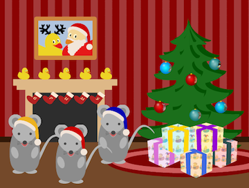      | ./samcarter/mouse/SingingMouse.tex   | 
| 2   | 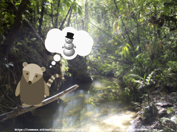      | ./samcarter/Coati/coati.tex |
| 3   | 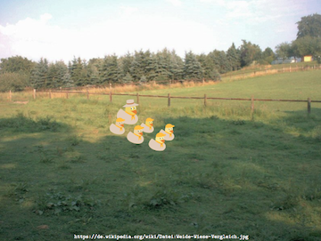     | ./samcarter/duckscouts/duckscouts.tex | 
| 4   | 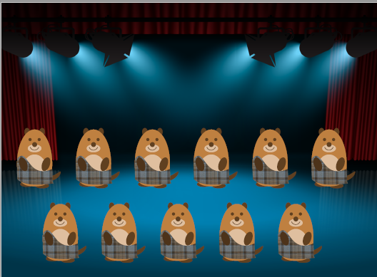 | ./ulrike/riverdance/riverdance.tex |
| 5   | 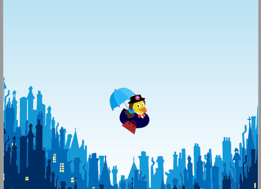       | ./paulo/MaryDuck/MaryDuck.tex |
| 6   | 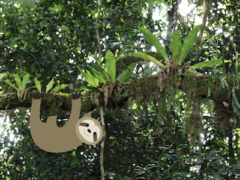          | ./samcarter/sloth/sloth.tex |
| 7   | 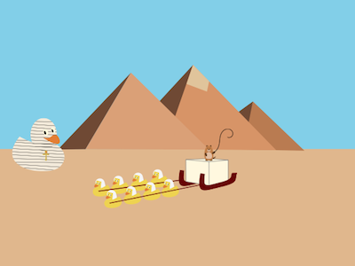         | ./samcarter/Egypt/Egypt.tex |
| 8   | 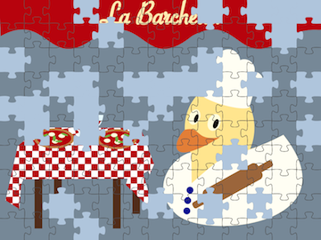     | ./samcarter/Puzzle/puzzle.tex | 
| 9   | 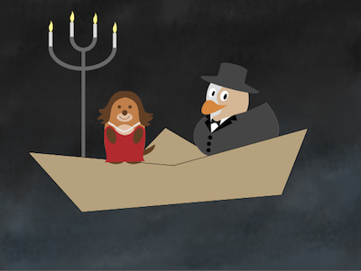         | ./samcarter/PhantomOfTheOpera/Phantom.tex |
| 10  | 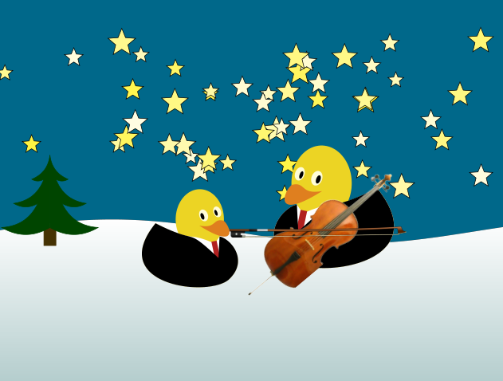      | ./ulrike/cello/celloducks.tex |
| 11  | 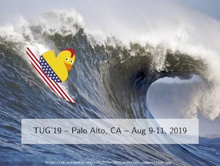       | ./samcarter/Surfing/Surfing.tex |
| 12  | 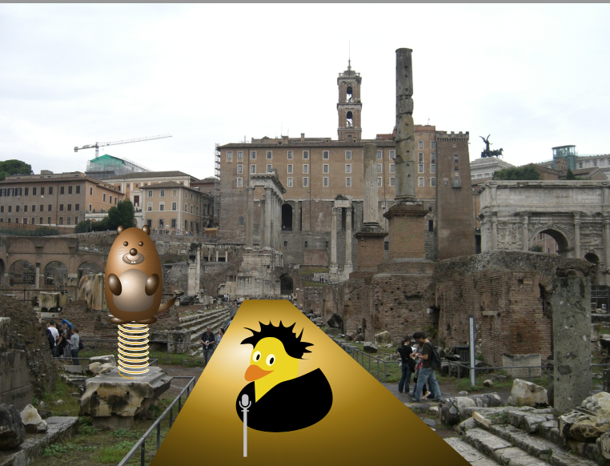      | ./ulrike/belloimpossibile/belloimpossibile.tex |
| 13  | 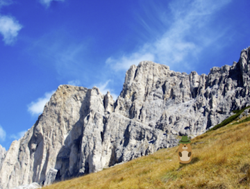      | ./ulrike/jodel/jodel.tex |
| 14  | 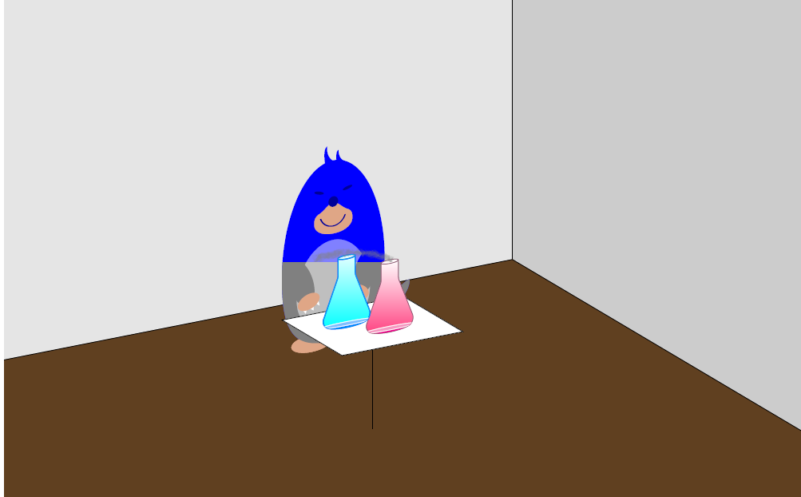 | ./marmot/ce_why_R_moles_gray.tex  | 
| 15  | 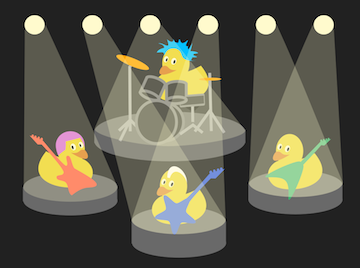       | ./samcarter/rock/rock.tex |
| 16  | 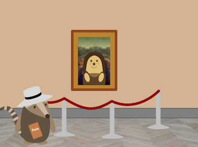       | ./samcarter/MarmotLisasSmile/MarmotLisasSmile.tex | 
| 17  | 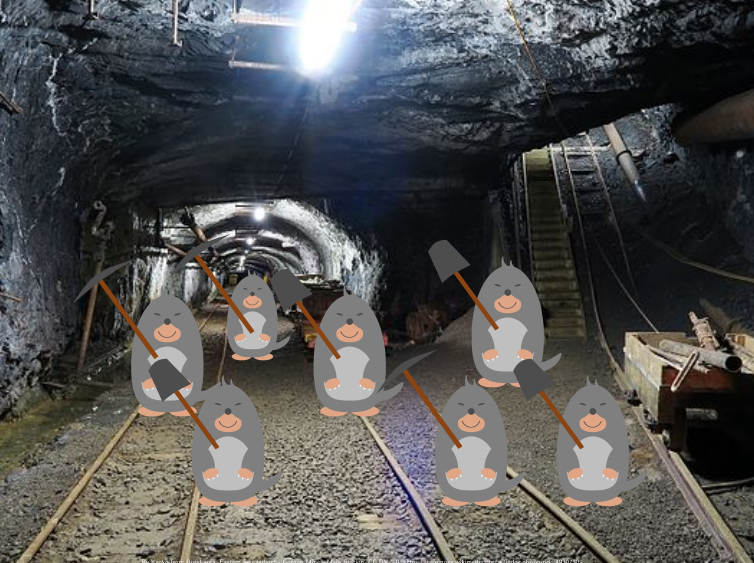      | ./ulrike/moles/workingmoles.tex | 
| 18  | 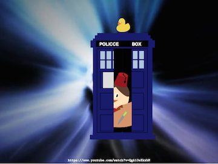     | ./samcarter/DrWho/DrWho.tex |
| 19  | 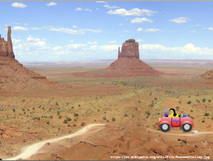       | ./samcarter/CarlaDriving/CarLaTeXDriving.tex | 
| 20  | 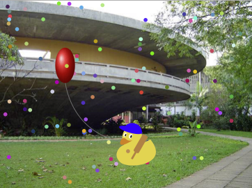       | ./ulrike/thesis/thesis.tex |
| 21  | 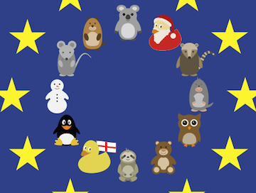     | ./ulrike/finale/finale.tex |
